# ASEAN Calorie Scanner App - Application Flow

## Overview

This document outlines the application flow for the ASEAN Calorie Scanner App, detailing the user interactions, screens, and system behaviors. It serves as a guide for developers to understand how various components of the application should interact.

## 1. User Authentication and Onboarding Flow

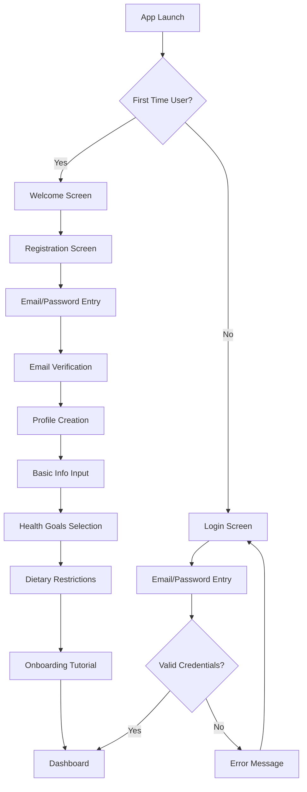

### 1.1 Registration Flow Details

1. **Welcome Screen**
   - App introduction
   - Benefits overview
   - "Get Started" CTA button

2. **Registration**
   - Email input with validation
   - Secure password creation
   - Terms and privacy policy acceptance

3. **Email Verification**
   - Verification email sent
   - Verification code input screen
   - Resend option

4. **Profile Creation**
   - Personal info: Name, age, gender
   - Physical stats: Height, weight
   - Activity level selection with visual guides
   - Health goals: Weight loss, maintenance, muscle gain
   - Optional: Allergies and dietary restrictions

5. **Onboarding Tutorial**
   - Walkthrough of key features
   - Food scanning demonstration
   - Dashboard introduction
   - "Skip Tutorial" option

## 2. Main Application Flow

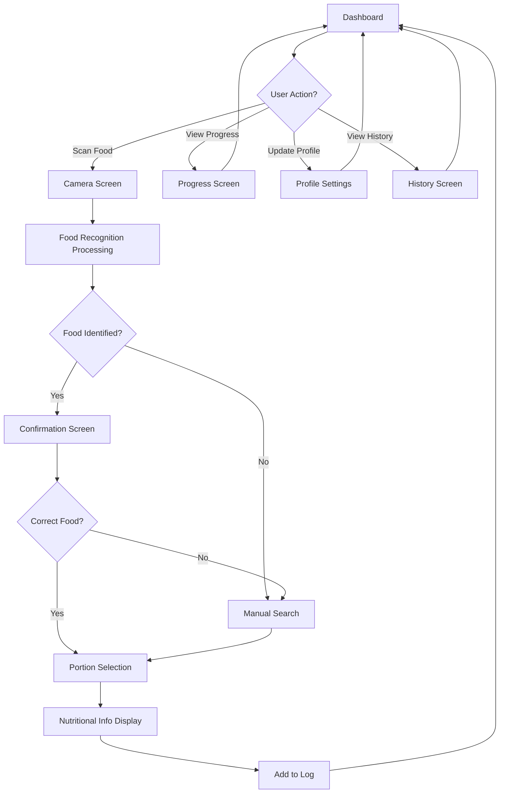

## 3. Food Scanning & Logging Flow

### 3.1 Food Scanning Process

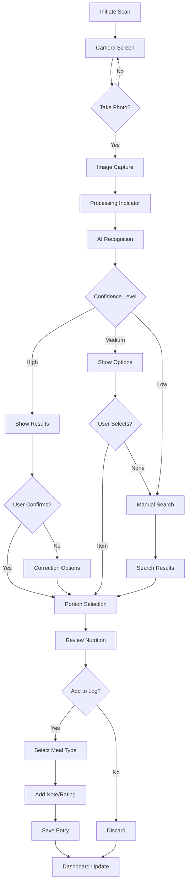

### 3.2 Meal Composition Details

1. **Simple Meals**
   - Single item identification
   - Portion estimation
   - Direct logging

2. **Complex Meals**
   - Multiple items in single photo
   - Component separation
   - Individual portion adjustment
   - Composite nutritional calculation

3. **Custom & Recurring Meals**
   - Save meal combinations
   - Quick-add favorites
   - Meal templates

## 4. Dashboard & Tracking Flow

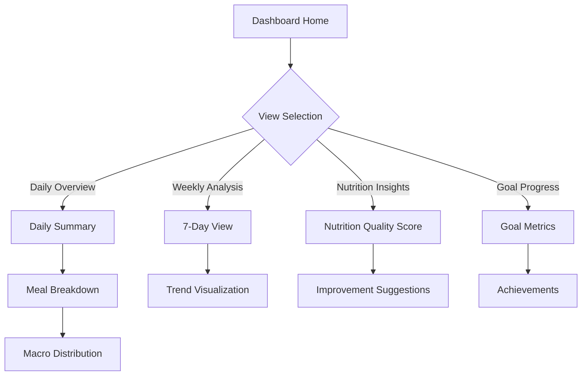

### 4.1 Dashboard Components

1. **Daily Summary**
   - Calorie goal vs. consumed
   - Macro breakdown with visual indicators
   - Meal-by-meal breakdown
   - Water intake tracking

2. **Nutrition Quality**
   - Balance score
   - Color-coded indicators
   - Nutrient density metrics

3. **Goal Progress**
   - Progress toward weight/health goal
   - Consistency streaks
   - Achievements and milestones

## 5. Settings & Personalization Flow

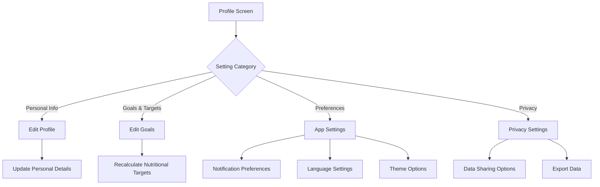

### 5.1 Settings Details

1. **Profile Management**
   - Update personal information
   - Progress photos
   - Weight history

2. **Goal Adjustment**
   - Modify weight/health goals
   - Adjust activity levels
   - Update dietary restrictions

3. **App Preferences**
   - Notifications and reminders
   - Language selection for ASEAN regions
   - Measurement units (metric/imperial)
   - Theme settings

4. **Privacy Controls**
   - Data sharing preferences
   - Export personal data
   - Delete account option

## 6. Key User Interactions

### 6.1 Food Logging

**Scan Flow:**
1. User taps "+" icon on dashboard
2. Selects "Scan Food"
3. Camera view appears with framing guides
4. User takes photo of food
5. Loading indicator appears during processing
6. Recognition results displayed
7. User confirms or corrects identification
8. Selects portion size
9. Reviews nutritional information
10. Assigns to meal type (breakfast/lunch/dinner/snack)
11. Optional: adds notes or tags
12. Saves entry
13. Dashboard updates with new data

**Manual Search Flow:**
1. User taps "+" icon on dashboard
2. Selects "Search Food"
3. Enters food name in search field
4. Browses results with ASEAN food emphasis
5. Selects correct food item
6. Follows same steps as scan flow from step 8

### 6.2 Progress Review

**Daily Review:**
1. User opens app to dashboard
2. Views today's summary
3. Taps on specific meal for details
4. Reviews macro distribution
5. Checks remaining calorie/macro budget

**Weekly Review:**
1. User navigates to Progress tab
2. Views 7-day overview
3. Examines trend charts
4. Reviews consistency metrics
5. Checks goal progress

### 6.3 Social & Community

**Recipe Sharing:**
1. User finds favorite meal in history
2. Taps "Share" option
3. Adds recipe details and preparation notes
4. Sets visibility (public/friends)
5. Posts to community feed

**Achievement Sharing:**
1. User earns milestone/achievement
2. Notification with share option appears
3. User customizes share message
4. Selects sharing platform
5. Posts achievement externally

## 7. System Flows

### 7.1 Data Synchronization

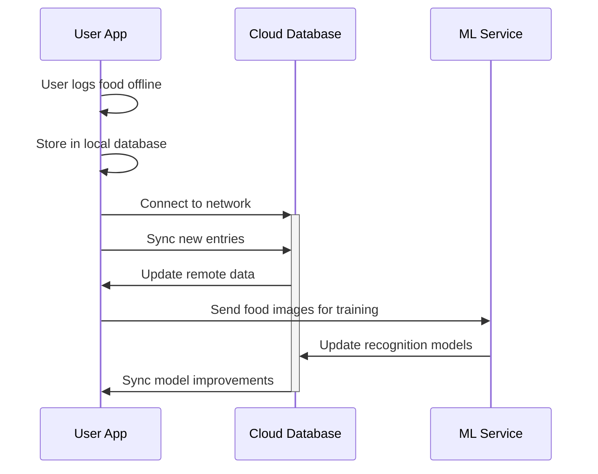

### 7.2 Food Recognition Process

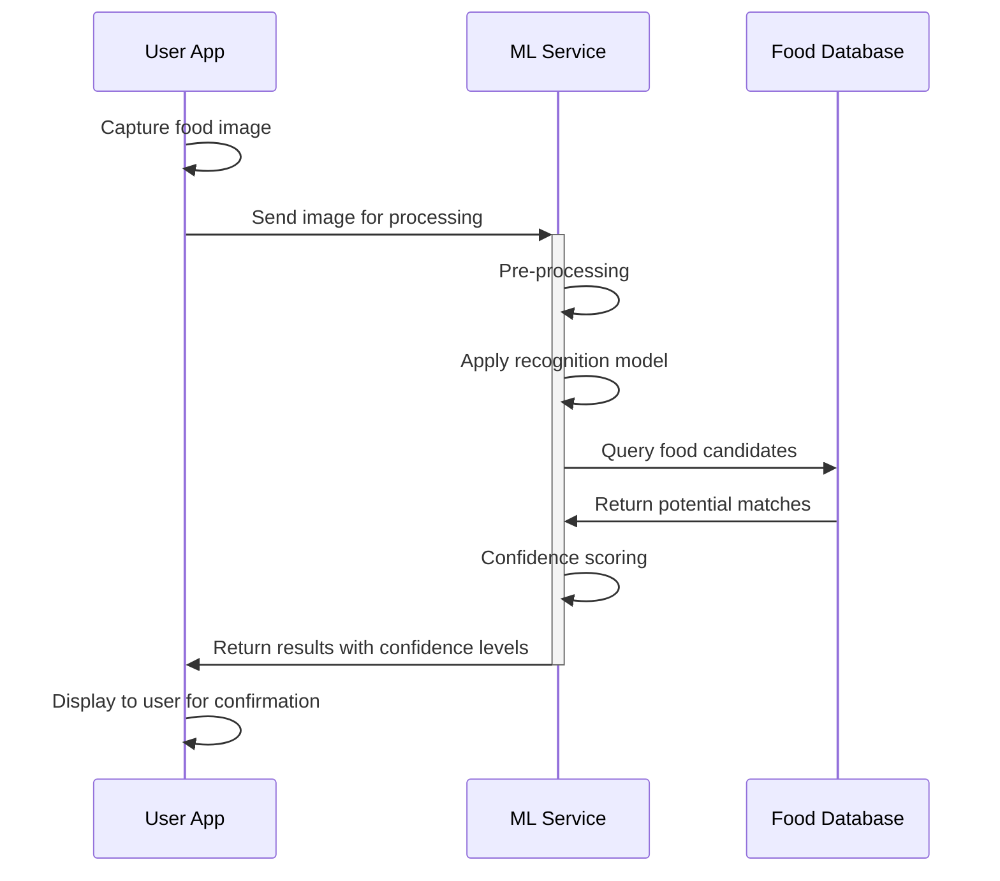

### 7.3 Personalized Recommendations

```mermaid
sequenceDiagram
    participant U as User App
    participant A as Analytics Engine
    participant R as Recommendation Engine
    
    U->>+A: Request insights
    A->>A: Analyze user patterns
    A->>A: Compare to goals
    A->>R: Send pattern data
    R->>R: Generate recommendations
    R->>-U: Return personalized suggestions
    U->>U: Display recommendations
```

## 8. Error Handling Flows

### 8.1 Recognition Failures

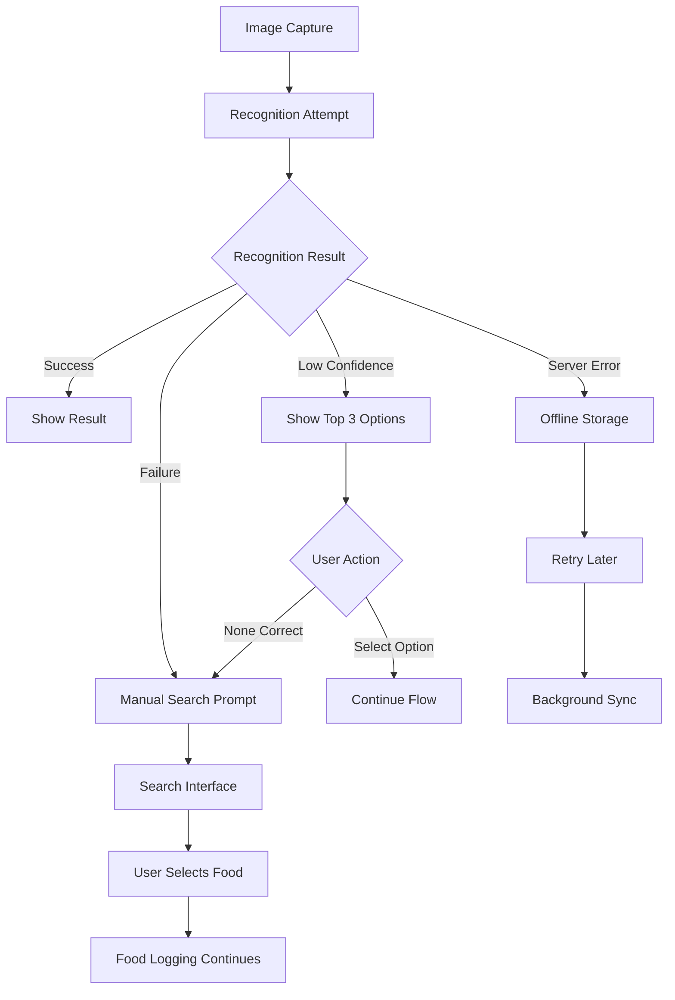

### 8.2 Connectivity Issues

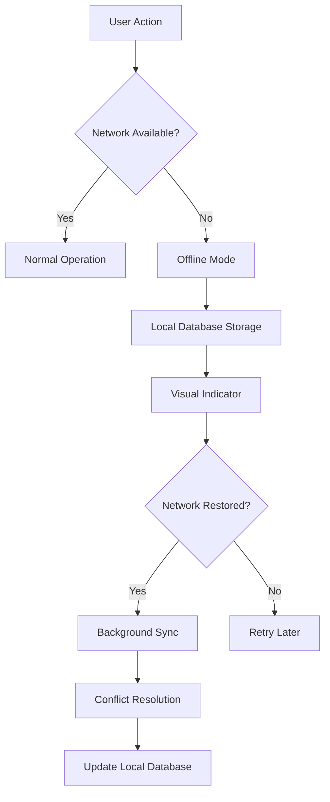

## 9. Special Flows for ASEAN Context

### 9.1 Regional Food Variants

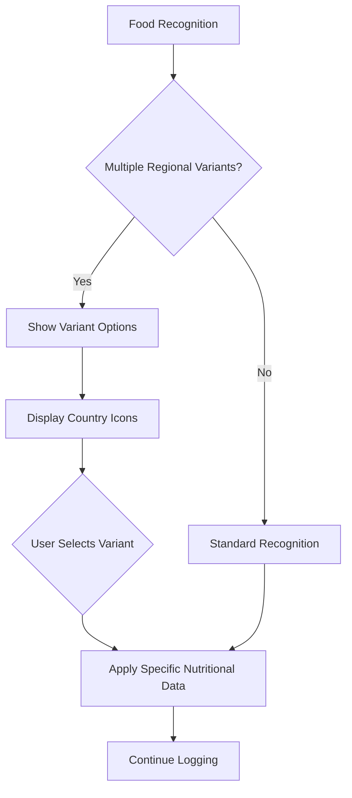

### 9.2 Language Switching

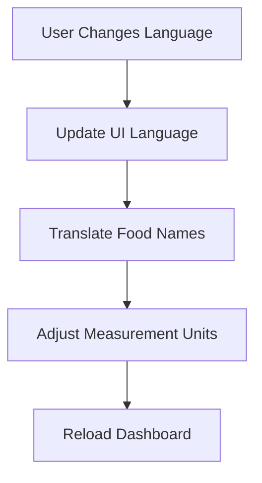

## 10. Key User Journeys

### 10.1 First-Time User

Day 1:
1. Downloads app
2. Completes registration and profile setup
3. Takes tutorial tour
4. Scans first meal with guidance
5. Views nutritional breakdown
6. Sets reminder for next meal

Day 2-7:
1. Responds to meal logging reminders
2. Builds consistent logging habit
3. Reviews daily summaries
4. Gets first weekly report
5. Adjusts goals based on initial experience

### 10.2 Health-Focused Regular User

Weekly Routine:
1. Logs all meals consistently
2. Checks nutrition balance daily
3. Reviews weekly trends each Sunday
4. Adjusts meal plans for upcoming week
5. Shares progress with support network

### 10.3 Diabetic User

Daily Routine:
1. Logs pre-meal blood glucose
2. Scans meal to check carbohydrate content
3. Makes food choices based on recommendations
4. Tracks post-meal glucose response
5. Reviews carbohydrate trends

## 11. Post-MVP Enhancement Flows

### 11.1 Social Community Features

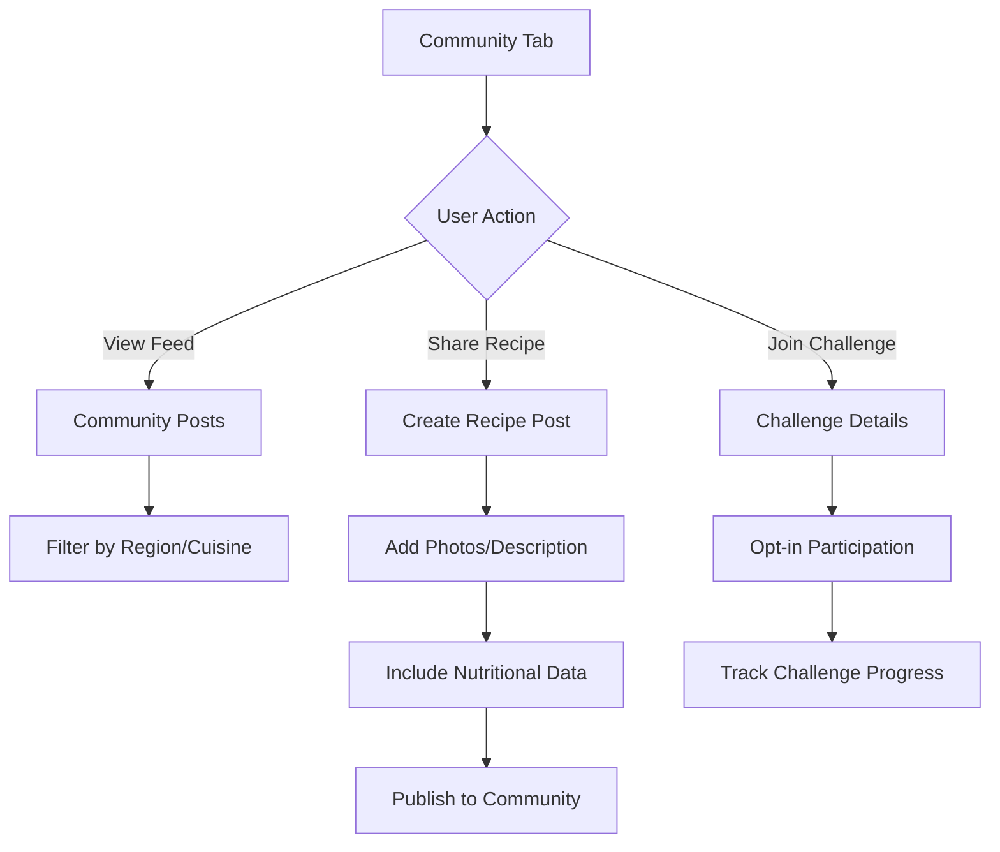

### 11.2 Advanced Analytics

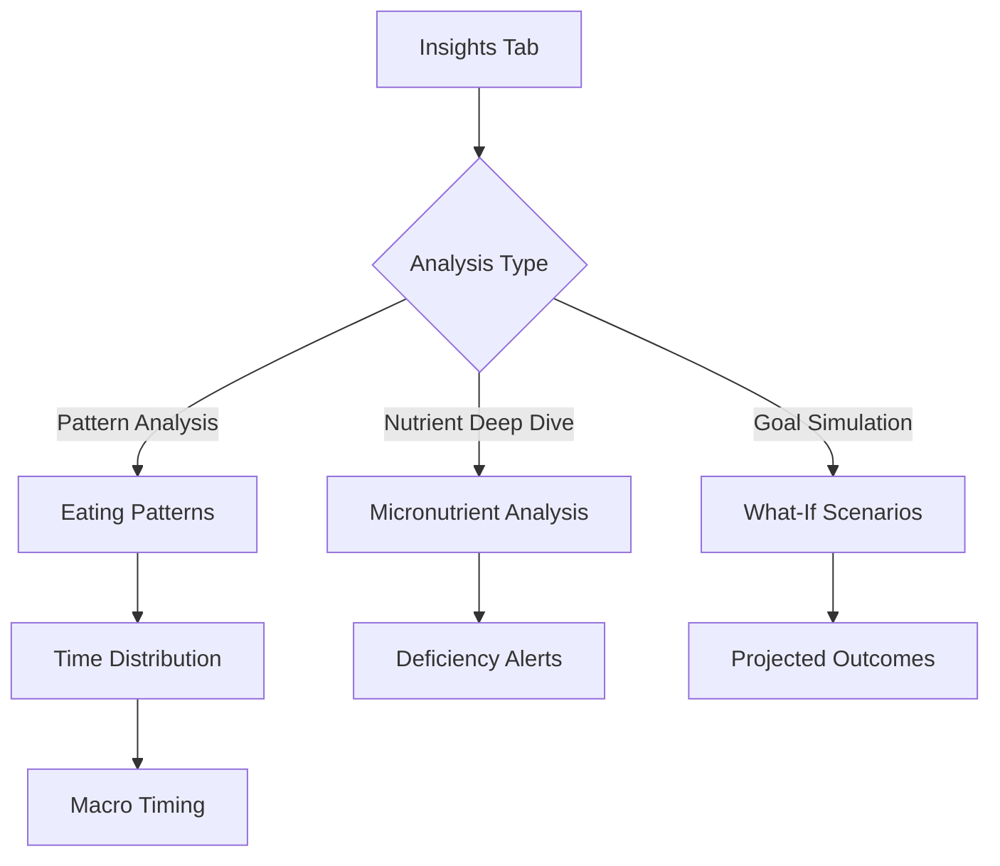

## 12. Data Integration Flows

### 12.1 Wearable Integration

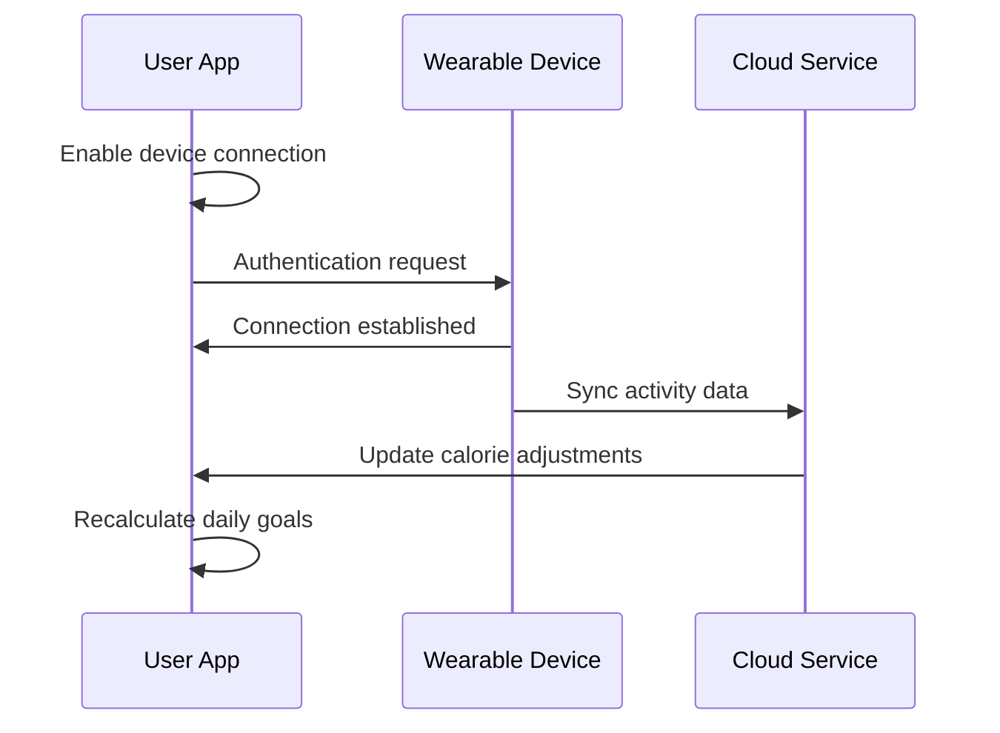

### 12.2 Health App Integration

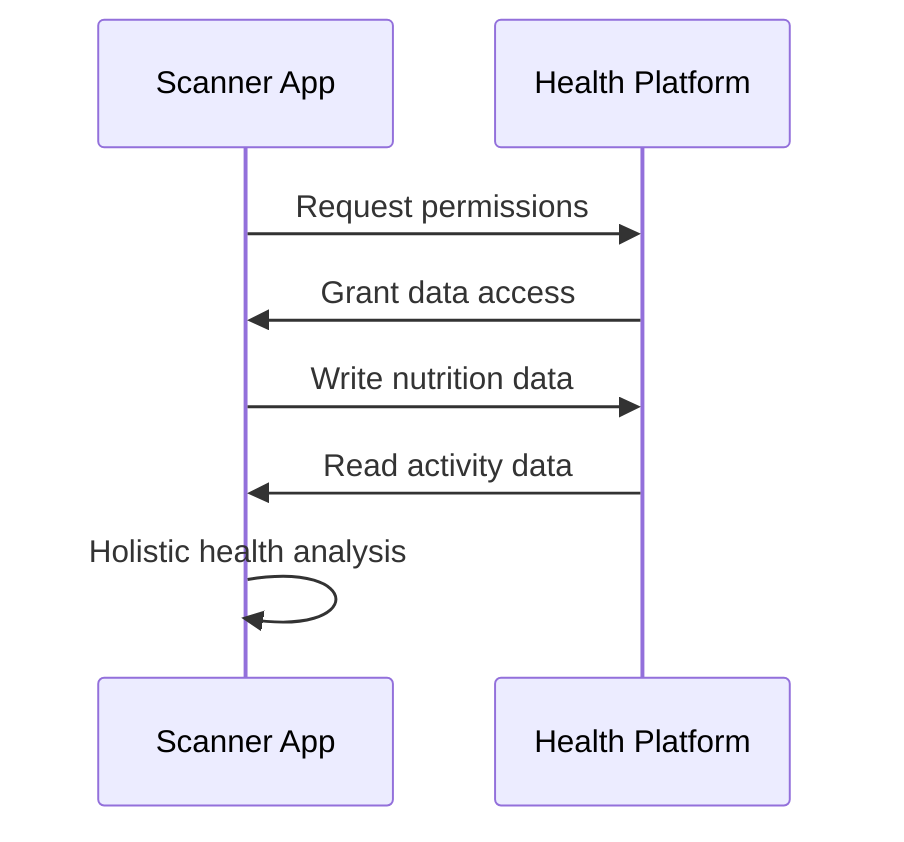

## 13. Cross-Platform Consistency

This application flow is designed to work consistently across:
- iOS and Android mobile platforms
- Tablet optimized layouts
- Web companion (future)

The user flow prioritizes:
- Minimal steps for common actions
- Consistent navigation patterns